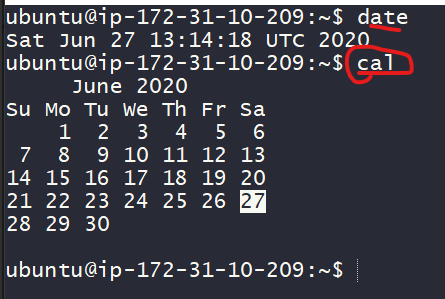

### Linux Foundation Series
## Linux – The Operating System

* RedHat Linux, Ubuntu, Centos, SUSE etc are called as distributions.
* Distribution is Linux + software suite of applications,developer tools
* In this essence Linux is core of the operating system: kernel

## Layers of Abstraction in Linux

* General Linux System Organization


* Layers are
    * Hardware
    * Kernel
    * User Process
* Kernel is in charge for managing
    * Processes
    * Memory
    * Device Drivers
* System Calls
    * fork
    * exec
* User Space:
    * Kernel allocates memory for user processes and this is called as userspace. 


* User: A user is an entity that can run processes and own files.

## Shell and Terminal
* When we speak of the commandline we are referring to shell. Shell is a program takes commands and passes them to OS to carry out.
* Almost all the distributions a shell program called as bash is supplied.
* To interact with shell we need a terminal

## Creating Linux Instances on the cloud
* Create a linux ec2 instance in aws
* Create a linux azure vm
* Prerequisities
    * Softwares
        * Git Bash
        * Visual Studio Code
* One free tier cloud account (AWS/Azure)
* Linux Distributions
    * Ubuntu 18
    * Centos 7
* Lets create a linux instance and login into that


## Standard Input and Standard Output
* Linux Processes use I/O streams to read and write data.
* Streams are very flexible, the source of input stream can be a file, device or it can be even the output stream of other process.

## Linux Commands
* In the shell prompt we generally execute commands. Lets execute some simple commands

```
date
cal
```


* Basic command syntax

```
<command> <args>
echo hello
```
* Arguments of two types
    * Positional arguments:

    ```
    <command> <arg1> <arg2> ...
    cp 1.txt 2.txt
    ```
    * Named arguments

    ```
    <command> --<argname> <argumentvalue>
    ping -c 4 google.com 
    ```
    * ls: this command is used to list the contents of the directory

    ```
    ls
    ls -a

    ```


* touch: this command creates an empty file

```
touch 2.txt
```

* cp: this command copies files

```
cp file1 file2
```

* mv: this command moves (rename) the files
* rm
* echo

## Linux directory hierarchy
* Linux directory


* / => root directory
* /bin => Binaries and other executables
* /etc => system configuration files
* /home => home directories
* /opt => optional or third party softwares
* /tmp => Temporary space
* /usr => User related programs
* /var => variable data, log
* experiment with mkdir, rmdir, less, file, head, tail, exit

## Environment and Shell variables
* Shell variables: Shell can temporarily store variables called as shell variables

```
<VAR-NAME>=<value>
TOPIC=linux
To access variable use $
echo $TOPIC
```

* Environmental variable: This is also like shell variable, but its not specific to the shell.

```
export <variable>
```

* There is one important environmental variable which is PATH. PATH variable will inform linux to find the commands

```
echo $PATH
```
## Using Text Editors
* Every linux generally has a text editor which is vim.
* To learn using vim please [refer here](https://www.openvim.com/)
* Other editor is nano

