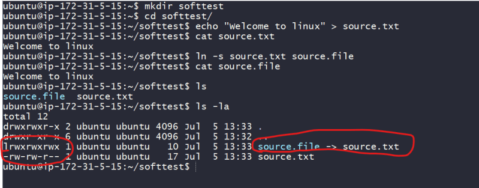
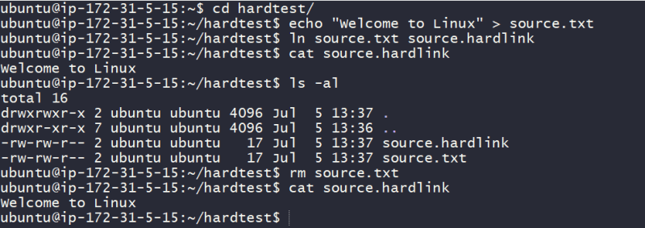
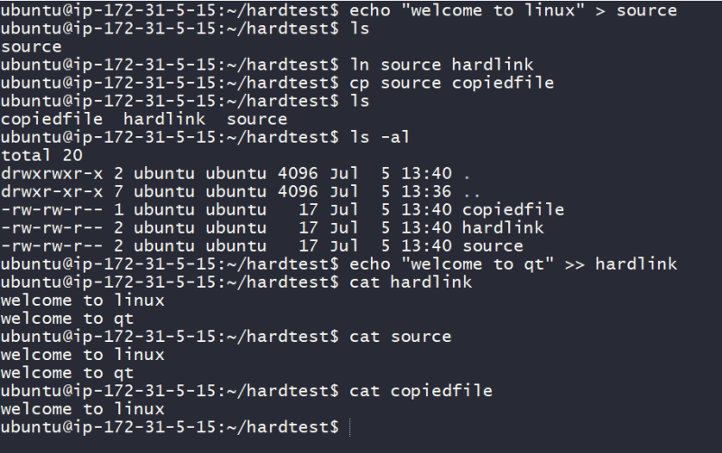
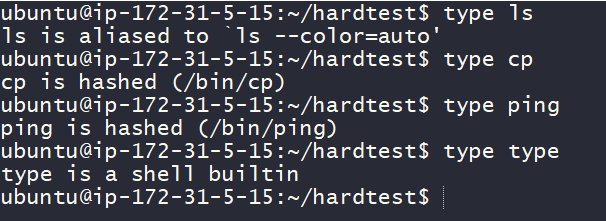

### Linux Useful utils
* Which Shell are you running?
    * Execute the command ``` echo $0 ```
* Aborting and suspending the execution of linux programs
    * Control-Z suspends the program
    * Control-C aborts the program
* Redirecting output of a command to a file instead of terminal (stdout)
    * ``` command > file ```
    * Eg: ping -c 4 google.com > pingresults.txt
    * If you want to append the text to existing file use >>
    * Eg: ping -c 10 google.com >> pingresults.txt
* Redirecting input can be done using < eg: head < /proc/cpuinfo

* Common Errors
    * NO Such file or directory
    * file exists
    * Not a Directory, Is a directory
    * NO space left of device
    * Permission Denied

* What is softlink (symbolic link) in linux and what is hardlink?

   * Softlink(symbolic) is an actual link to original file whereas hard link is a mirror copy of original file.
   * If you delete the original file, soft link has no value (since t whatever file it points no longer exists)
   * If you delete the original file, hard link will still has the data of the original file
   * Softlink
       * Can cross the file systems
       * Allows you to link between directories
       * permissions will not be updated
       * has only the path to original file not contents
    * Hard link
        * Can’t cross file system boundaries (it exist on same filesystem)
        * can’t link directories
        * permissions will be updated if we change the source
        * It has contents of original file
    * Create a Symlink or softlink

    

    

    * Create a hardlink

    

    * What will be difference between hard link and normally copied file?
    
    

* Identifying Commands
    * type: Type is a shell builtin command which displays the kind of command once you give a particular command

    ```sh
    type ls
    type cp
    type ping
    type type

    ```


    

    * which-Display an Executable location
        ``` which ls ```

       

    * Getting a Commands Documentation
        * help: bash has a built-in help facility for each of the shell builtins.
         ``` help cd ```
        * –help: Many executable programs support a –help option displays the description of commands
        ``` mkdir --help ```
        * man: Most executable programs intended for command line usage will provide manual

        ``` 
        man <command> 
        man ls  
        ```
        * apropos-Display appropriate commands
        ``` apropos partition ```
        * info command: This command will show mauals with hyperlinked much like web docs

## Pipelines
* Is a capability of commands to read output of command as input to other command
Generally operator | is referred as pipe

``` command1 | command2 ```
* Pipelines are often used to perform complex operations on data. It is possible for you to put several commands together into a pipeline

```
ls -al /bin /usr/bin | sort | less
ls -al /bin /usr/bin/ | sort | uniq | wc -l
```
## tee
* tee command will read from stdin and send the output to stdout and files

```
ls -al /bin /usr/bin | tee ls.txt | sort | uniq | wc -l
```

