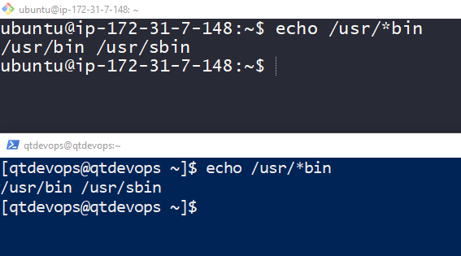

### SEEING THE WORLD AS SHELL SEES
* Lets look at some of the magic that occurs in the command line when we press ENTER key.

## Expansion
* Each time we type a command & press Enter key, bash performs several substititutions upon text before command is executed. The process that makes it happen is called expansion
* To demonstrate this lets try

```
echo Welcome to Linux by Khaja
```


* Note: IMages with terminal in black (git bash) is connected to ubuntu 18 and Images with terminal in blue (powershell) is connected to centos 8.1
* Now lets execute the following


* What happened? * is a wild card character, so your bash will try to find/match any characters in the files present in current working directory (cwd).
* So initially when we executed there were no files in cwd, so it printed *. Then we created two files and execute echo * again, now * will match any file name in cwd so it printed the file names
* Pathname Expansion: The mechanism by which wild cards work is called as pathname expansion
* Lets experiment with the following

```
create two directories Videos and Documents in the cwd
```


* Lets use pathname expansions

```
echo D*
echo *s
echo *t
```




* Tilde Expansion: Tilde ~ expans into the name of home directory of the current user


* Arithmetic Expansion: Shell allows you to expand arithmetics and the syntax would be $((expression))
    * Operators are
        * __+__ : Addition
        * __–__ : Subtraction
        * __*__ : Multiplication
        * __/__ : Division
        * __%__ : Modulo (remainder)
        * __**__: Exponentation

        

* Brace Expansion: Brace expansion can create multipe text strings


* Using brace expresiion lets try to create folder for every month from year 2017 to 2020 in the format of yyyy-mm


* Parameter Expansion:


* Command Substitution: this allows us to use output of a command as expansion


* Quotes 


* Supress expansion:


