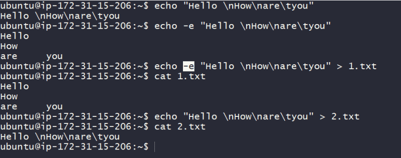
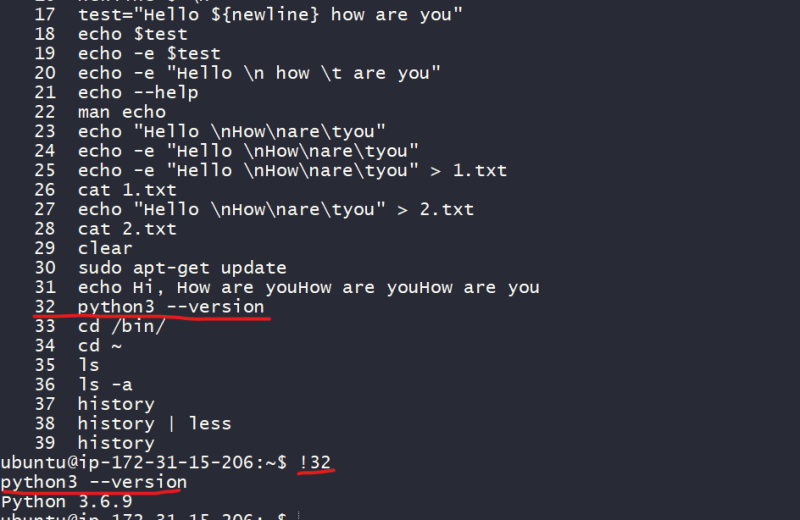

### Escaping Characters
* Using Backslash escape sequences


* Backslash escape sequences
    * \a => Bell
    * \b => Backspace
    * \n => new line
    * \r => Carriage return
    * \t => Tab return

    


## Keyboard tricks
* bash uses a library called Readline to implement command line editing.
* Cursor Movement Commands

    * CTRL-A : Move the cursor to begining of the line
    * CTRL-E : MOve the cursor to the end of line
    * CTRL-F: same as right arrow key
    * CTRL-B: same as left arrow key
    * ALT-F: Move cursor forward by one word
    * ALT-B: Move cursor backward by one word
    * CTRL-L: same as using clear command


* Modifying Text:

    * CTRL-D: Delete the character at cursor location
    * CTRL-T: exchanges the character at the cursor location with one preceding it
    * ALT-T: exchanges the word at the cursor location with one preceding it
    * ALT-U: converts the characters from cursor location to the end of the line to uppercase
    * ALT-L: converts the characters from cursor location to the end of the line to lowercase

* Killing and yanking (Cutting and Pasting) Text

    * CTRL-K: Kill text from the cursor location to the end of the line
    * CTRL-U: Kill text from the cursor location to the begining of the line
    * CTRL-Y: Yank the text from kill-ring (clipboard) and insert at current cursor location
    * ALT-D: kill text from cursor location to the end of current word
    * ALT-backspace: kill text from cursor location to the begining of current word
* COMPLETION: shell can help you through a mechanism called as completion. Completion occurs when your press TAB key while typing command

   * In Recent versions of bash has a facility called as programmable completion.

* Using History

   * Bash maintains the history of commands that have been entered. This list of commands are kept in your home directory in a file called as bash_history
   * commands to try

   ```
   history
   history|less
   ```

  

  * Commands
      * CTRL-P or up-arrow: Move up to the previous history entry
      * CTRL-N or down-arrow: Move to the next history entry
  * Seqence Action
      * !!: Repeat the last command
      * !number: Repeat history list item number
      * !string: Repeat last history item starting with string
      * !?string: Repeat last history item containing string