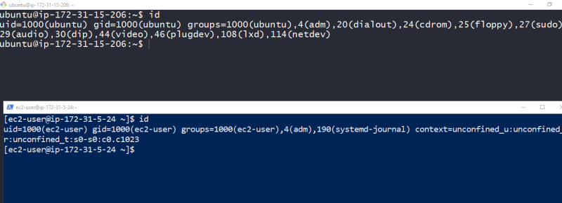

### Permissions
* Traditionally linux is a multiuser system which differs from MS-DOS which is a multi tasking system.
* Since more than one person can be using the computer at the sametime, we need to some sort of permissions in linux.
* So lets look at these commands which are essential part of linux system security
     * id: Display User identity
     * chmod: Changes file’s mode
     * umask: Set the default file permissions
     * su: Run a shell as another user
     * sudo: Execute a command as another user
     * chown: Change file’s owner
     * chgrp: Change a file’s group ownership
     * passwd: Change a user’s password
     * useradd: add the user using a built-in linux
     * adduser: adds the user using a perl script that internally useradd
     * groupadd: creates a new group

## OWNERS, Group members and Everybody else
* note: Through out this series , terminal with blue background is connected to redhat and terminal with black ground is connected to ubuntu 18 


* Lets execute a simple check on /etc/shadow 


* The reason for this error message is , we dont have permission to read this file
* In this it is very critical to file, to know how to gain control access over file, give permissions to special groups and all the others (everybody)
* Lets find the information about our identity using __id__ command 



* Id’s commands output. When a user is created in linux, users are assigned a number called as uid (user id), The user is assigned a group ID (gid) and may belong to additional groups
* All of this information in linux comes from couple of files

    * /etc/passwd: User accounts are defined
    * /etc/group: groups are defined
* /etc/shadow is the file which also gets modified when users and groups are created as it holds information about user’s password.
* In linux systems, there are superuser accounts (uid 0)

## Reading, Writing and Executing
* Access rights to files and directories are defined in terms of read access, write access and execution access
* Lets create a simple test.txt as shown below and execute the commands 


* The first character highlighted in the below image are file attributes 


* The first of these characters will help us in describing file type
    * __–__ => A regular file
    * __d__ => directory
    * __l__ => A symbolic link
    * __c__ => A character special file eg terminal
    * __b__ => A block special file eg: hard drive or DVD drive
* The remaining nine characters of the file attributes are called as file mode, They represent read, write and execute permissions for the file’s owner, the file’s group owner and everybody else 


* Permission Attributes
    * r => Allows file to be opened and read, Allows a directory contents to be listed
    * w => Allows file to be written to or truncated. The ability to delete or rename file is determined by directory attributes. Allows files in the directory to be created deleted and renamed.
    * x => Allows a file to be treated as a program and executed. Program files written in scripting must also be set as readable to executed. Allows a directory to be entered
* File attributes:
    *  -rwx—— => A regular file that is readable, writable and executable only by the files owner, no one else has access
    * -rw——- => A regular file that is readable and writable by file’s owner, no one else has access
    * -rw-r–r– => A regular file that is readable and writable by file’s owner, Members of file owners group may read the file. The file is world-readable
    * -rwxr-xr-x => A regular file that is readable, writable and executable by files owner. The file may be read or executed file’s group member and world
    * drwxrwx— => A directory. The owner and members of owners group may enter the directory and create, rename and remove files from the directory
* chmod: Change file mode
    * numeric notation
        * read ‘r’ = 4
        * write ‘w’ = 2
        * execute ‘x’ = 1
    * examples:
      ```
      666 => rw-rw-rw-
      755 => rwxr-xr-x
      400 => r--------
      ```
    * To change file mode we use chmod
    * Chmod Symbolic notation
        * u => user
        * g => group
        * o => others
        * a => all
    * Symbolic notation examples
        * u+x => Add execute permission for the owner
        * u-x => Remove execute permission for the owner
        * +x => Add execute permission for owner,group and world => a+x
        * o-rw => Remove read and write permissions for others (world)
        * go=rw ? (Exercise)
        * u+x,go=rx ? (exercise) 

        


