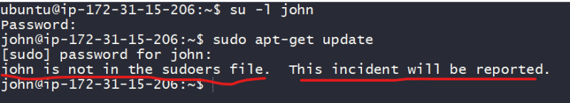

### Changing identities
* Often, we want to gain superuser previleges to carry out some adminstritative tasks. what are possible ways
    * Logout and log back in as alternative user
    * Use the __su__ command
    * Use the __sudo__ command

* For experimentation lets create 3 user john, rick, siva

```
sudo -i # become root user
adduser john
adduser rick
adduser siva
```


* Since in AWS password authentications are disabled we will be enabling

```
vi /etc/ssh/sshd_config
change PasswordAuthentication to yes
service sshd restart
exit
```


## su: Run Shell with Substitute User and Group Id
* __su__ command will look like

```
su [-[l]] [user]
```
* Execute help for __su__

```
man su
su --help
```
* Lets try to become john 


* Lets try to become rick


* If you want to become root user and if root user has a password


```
su -
```
* Lets look at file ‘/etc/passwd’


* With default user (ubuntu) lets execute ``` sudo apt-get update ``` and it works 


* Lets try to execute same command by switching user to john



* How to give john the permission to execute sudo commands?
    * become ubuntu (default) user

```
sudo cat /etc/sudoers
```


* John is not part of sudoers file so lets add john to sudoers

```
# login as default user (ubuntu)
sudo visudo
```


* If we want to execute any command with sudo on the ubuntu machine user should be part of sudoers file, then user can execute commands with sudo.
* Sudo is run a command as superuser

## chown: Change File Owner and group
* Lets create a simple file as john 


* I want to change the owner of this file to rick. This is where a linux command chown comes into play

```
man chown
chown --help
```
* Syntax is

```
chown [owner][:[group]] <file>
```
* lets change ownership of a file 


* Now lets see how to change ownership of folder 


